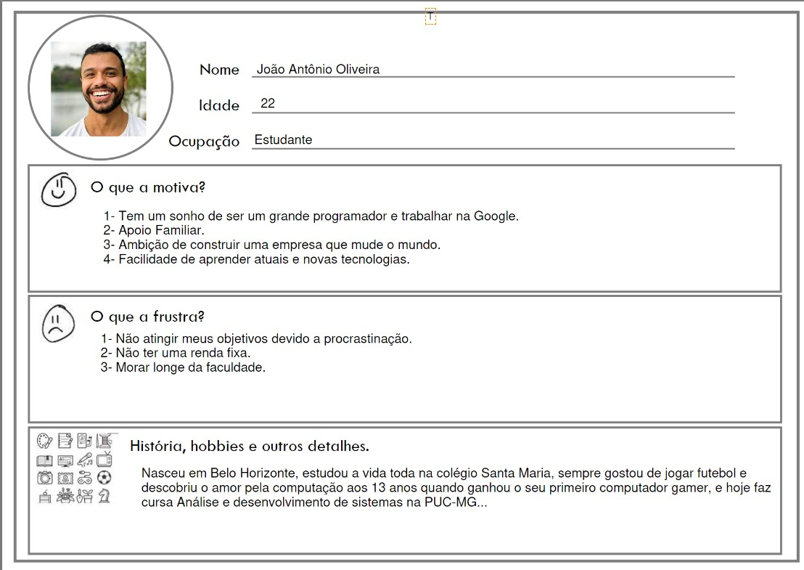
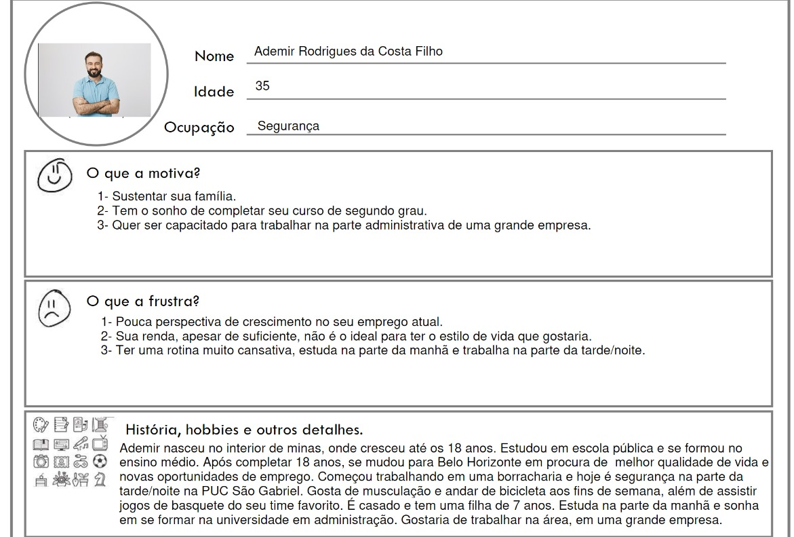
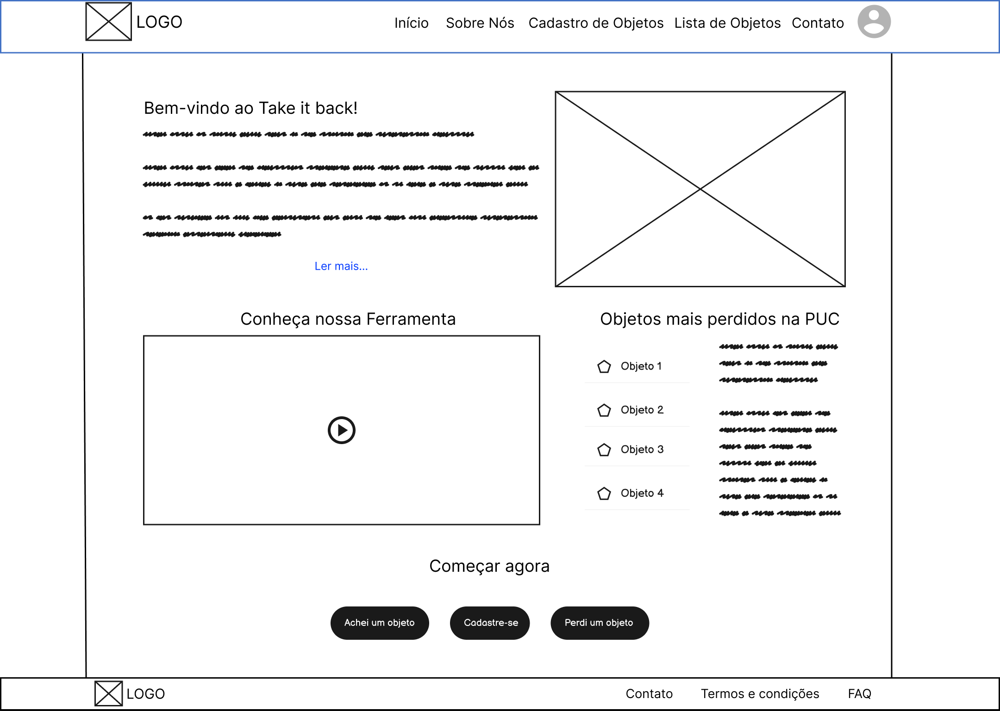
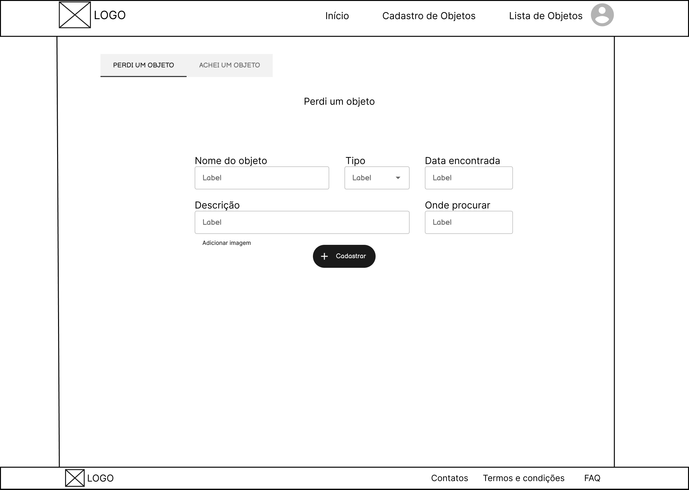
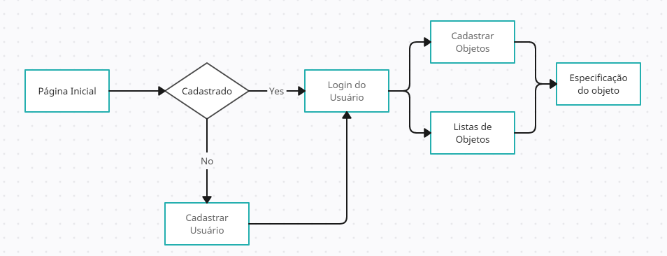

# Informações do Projeto
`TÍTULO DO PROJETO`  

Take It Back

`CURSO` 

Sistemas de Informação

## Participantes

Os membros do grupo são: 
 - Pedro Melo
 - Rafael Mendes
 - Samuel Leite Diniz
 - Wesley Henrique de Lima

# Estrutura do Documento

- [Informações do Projeto](#informações-do-projeto)
  - [Participantes](#participantes)
- [Estrutura do Documento](#estrutura-do-documento)
- [Introdução](#introdução)
  - [Problema](#problema)
  - [Objetivos](#objetivos)
  - [Público-Alvo](#público-alvo)
- [Especificações do Projeto](#especificações-do-projeto)
  - [Personas](#personas)
  - [Histórias de Usuários](#histórias-de-usuários)
  - [Requisitos](#requisitos)
- [Projeto da Solução](#projeto-da-solução)
  - [Wireframes](#wireframes)
  - [Mapa de navegação](#mapa-de-navegação)
- [Conclusões](#avaliação-da-aplicação)
  
# Introdução

## Problema

Devido a correria do dia a dia, muitas pessoas acabam esquecendo seus objetos no trabalho, faculdade, transporte público, etc. Na PUC-Minas São Gabriel, os alunos, professores e funcionários são afetados diretamente por esse problema. Objetos, muitas vezes de valor, são esquecidos por toda a área do campus, principalmente nas salas de aula. Apesar do problema, não existe um meio fácil e prático de procurar, recuperar ou anunciar o achado de itens perdidos.

## Objetivos

Nosso objetivo é criar uma ferramenta em que possa ajudar e tornar mais prática a procura por objetos perdidos na PUC-Minas São Gabriel. Gostaríamos de criar um site de forma simples que possa disponibilizar acesso aos itens perdidos e cadastrados na puc, solicitar um item perdido ou adicionar algo que tenha achado e também facilitar a comunicação entre quem perdeu, quem achou e o achados e perdidos presencial.

## Público-Alvo

 Publico alvo de modo geral são todas as pessoas que frequentam e trabalham na PUC-Minas São Gabriel, que por um acaso podem acabar perdendo algum objeto pessoal e que futuramente necessitaram de ajudar para reencontrar seus objetos perdidos. Especificamente as pessoas são os alunos, professores e funcionários que estarão sempre por todo campos, Seja um aluno ou professor que estará sempre participando de aulas em diferentes salas e horários ou funcionário que atuara em setor especifica da sua função.
 
# Especificações do Projeto

O projeto será basicamente um site com sistema de login e cadastro de todos membros da PUC-Minas São Gabriel, que depois de autenticado poderá realizar cadastro de objetos perdidos ou encontrados e também realizar buscas em nossas listas de objetos cadastrados no sistema. Estes objetos contara com as descrição e especificações do objeto tanto como o contato para devolução e um possível local de procura.

## Personas

## Histórias de Usuários

Com base na análise das personas forma identificadas as seguintes histórias de usuários:

|EU COMO... `PERSONA`| QUERO/PRECISO ... `FUNCIONALIDADE` |PARA ... `MOTIVO/VALOR`                 |
|--------------------|------------------------------------|----------------------------------------|
| Aluno (Perdeu)     | De uma lista com objetos encontrados na faculdade| Encontrar meu objeto perdido|
| Aluno (Perdeu)     | Divulgar meu objeto pessoal perdido| Encontrar alguém que tenha achado|
| Funcionário (Achou)| Informar que achei um objeto| Pessoa que perdeu recuperar direto comigo|
| Funcionário        | Preciso registrar os objetos perdidos na faculdade| Ter controle da saída e entrada de objetos no achados e perdidos|

## Requisitos

A tabela que segue apresenta os requisitos funcionais do projeto. 

### Requisitos Funcionais

|ID    | Descrição do Requisito  | Prioridade |
|------|-----------------------------------------|----|
|RF-001| Cadastro de objetos perdidos e encontrados | ALTA | 
|RF-002| Lista de objetos perdidos e encontrados | ALTA |
|RF-003| Marcação para retirar da lista objetos já devolvidos | MÉDIA |

# Projeto da Solução

O projeto é desenvolvida em linguagens Html, Css , JavaScript e também com o framework Bootstrap. Além do Font Awesome um conjunto de ferramentas de ícones e fontes.

## Wireframes

**Pagina de apresentação**:

Contém apresentação do site e sua função.

**Cadastro de objetos**:

Contém formulário necessário para cadastro de um objeto.

**Lista de objetos**:

Contém categorias e lista de objetos.

## Mapa de navegação

# Conclusões

......  COLOQUE AQUI O SEU TEXTO ......

> Finalize escrevendo um ou dois parágrafos para relembrar o objetivo do projeto, 
> o que foi possível alcançar e o que ficou para um trabalho futuro, e relembrando
> as principais dificuldes encontradas e como foi possível contorná-las. 

